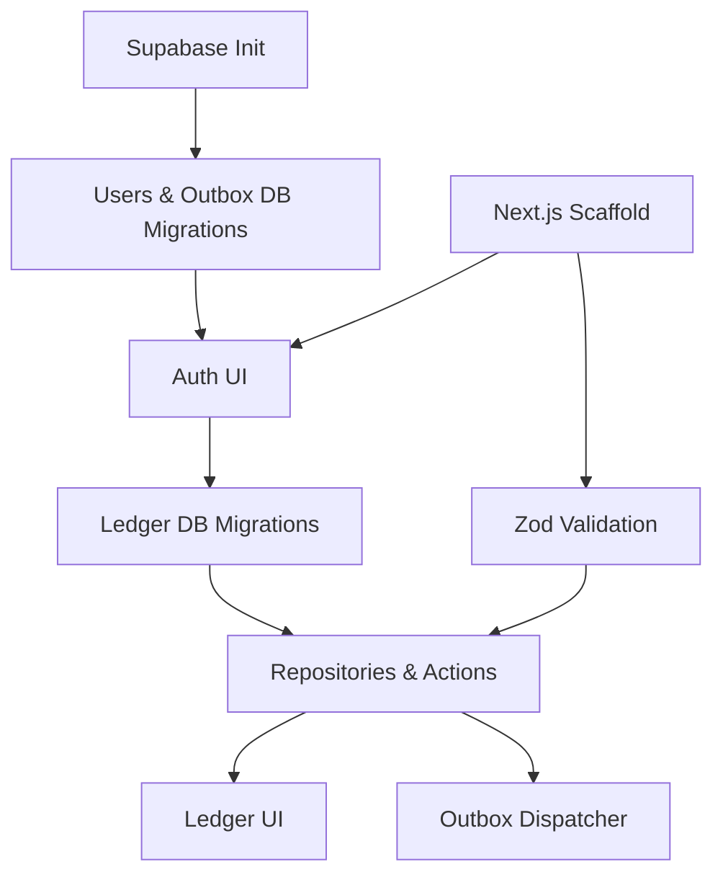

# Dependency Graph

```mermaid
graph TD
    TSK-102[Supabase Init] --> TSK-103[Users & Outbox DB Migrations]
    TSK-103 --> TSK-104[Auth UI]
    TSK-101[Next.js Scaffold] --> TSK-104
    TSK-104 --> TSK-201[Ledger DB Migrations]
    TSK-201 --> TSK-203[Repositories & Actions]
    TSK-101 --> TSK-202[Zod Validation]
    TSK-202 --> TSK-203
    TSK-203 --> TSK-204[Ledger UI]
    TSK-203 --> TSK-205[Outbox Dispatcher]
```

**Critical Path**: `TSK-102 -> TSK-103 -> TSK-201 -> TSK-203 -> TSK-204`
